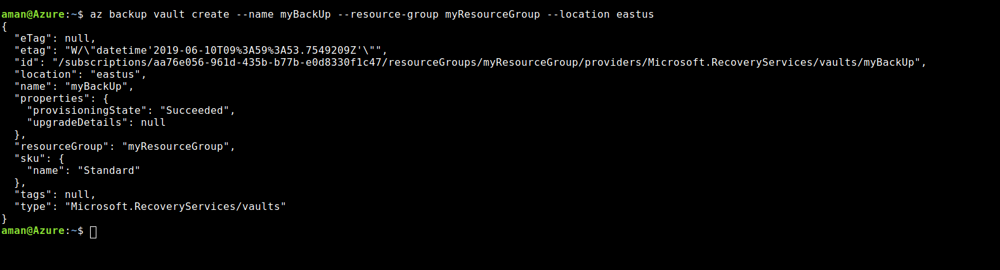
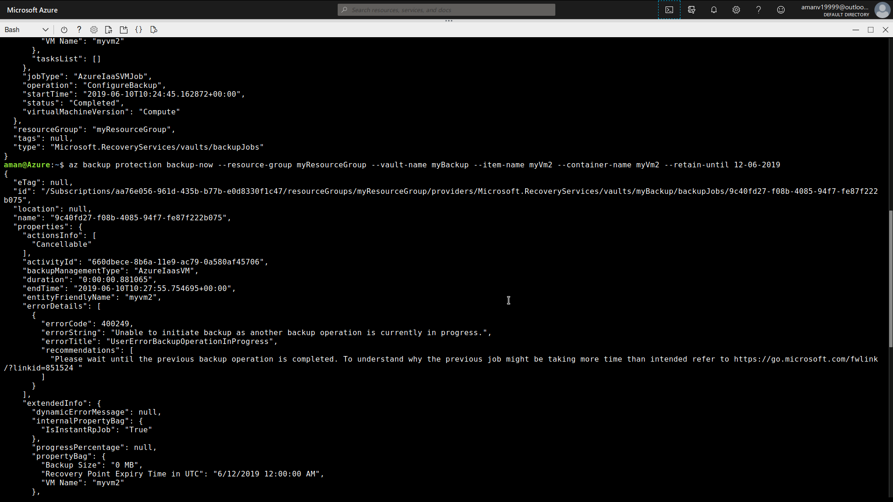
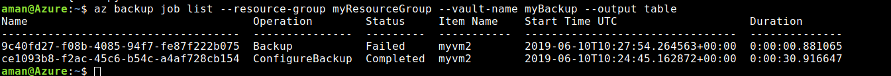

## Backup
Recovery Vault is a container that stores the backup of your protected data. When backup process runs, it creates a recovery point . When your data is lost you can recovery data from there.

- Create a backup vault
```
az backup vault create --location eastus --name myBackup --resource-group myResourceGroup
```


- Change the vault properties
By default backup is set to Geo-Redundant
```
az backup vault backup-properties set --name myBackup --resource-group myResourceGroup --backup-storage-redundancy "LocallyRedundant/GeoRedundant"
```

- Enable backup protection
```
az backup protection enable-for-vm --resource-group myResourceGroup --vault-name myBackup --vm myVm2 --policy-name  DefaultPolicy
```


- Instant backup
```
az backup protection backup-now --resource-group myResourceGroup --vault-name myBackup --item-name myVm2 --container-name myVm2 --retain-until 12-06-2019
```


- Display  list
```
az backup job list --resource-group myResourceGroup --vault-name myBackup  --output table
```
