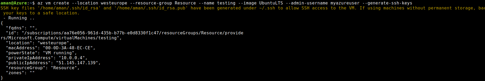

# Hosting a Webapp in VM

## Create a VM machine 
```
az vm create --resource-group <group_name> --name <VM name> --image UbuntuLTS --admin-username <name> --generate-ssh-keys
```



## Open port 80 
```
az vm open-port --resource-group <group_name> --name <VM name> --port 80
```


## SSH Login

```
ssh <adminusername>@<public IP of your VM>
```


## Register the mongoDB key
```
sudo apt-key adv --keyserver hkp://keyserver.ubuntu.com:80 --recv 9DA31620334BD75D9DCB49F368818C72E52529D4
```


## Register the repo
```
echo "deb [ arch=amd64,arm64 ] https://repo.mongodb.org/apt/ubuntu xenial/mongodb-org/4.0 multiverse" | sudo tee /etc/apt/sources.list.d/mongodb-org-4.0.list
```


## Install libcurl3 ,mongodb-server-org, mongodb-server


## Install nodejs
```
sudo apt install nodejs
```

## Move the code inside the VM

Exit the vm by using ```exit```.
```
scp <repo name> <azureuser>@<public ip of vm>:<place to copy>
```

## Run the app
```
npm install
sudo node server.js
```

This is how we host a MEAN Stack App in a VM
