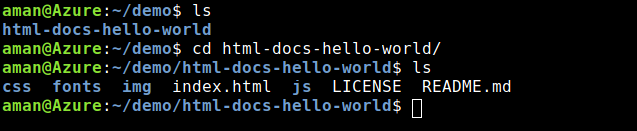

## Hosting Static files on Azure

Hosting Static files on Azure is damn to easy. Azure make things so much easy that you don't need to put much efforts to host your static files.

- Download a demo repo on Cloud CLI

```
mkdir testing
cd testing
git clone https://github.com/Azure-Samples/html-docs-hello-world.git
or
git clone https://github.com/nightwarrior-xxx/demo_static_site_for_testing
```

- Move into the cloned repo and host
```
cd html-docs-hello-world
or
cd demo_static_site_for_testing

az webapp up --location <location eg:- westeurope, eastus> --name <app_name>
```


Azure will hardly take two to three minutes and your site will be up 


