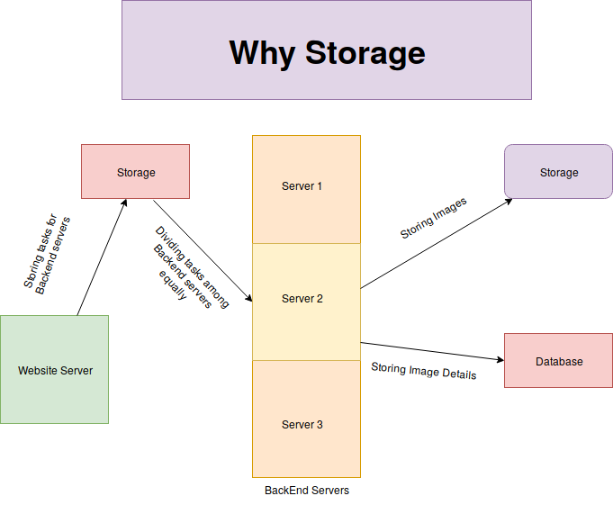
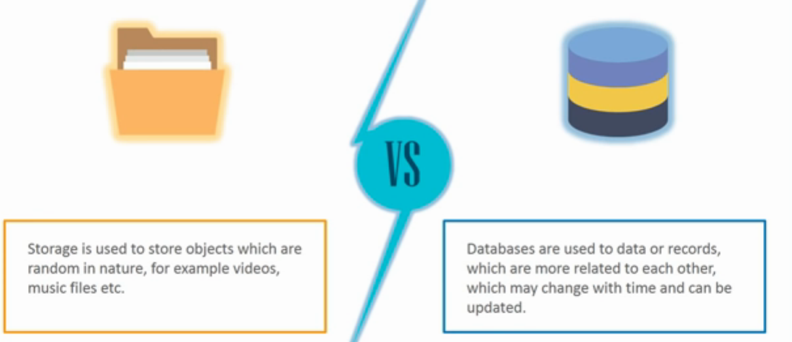
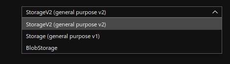
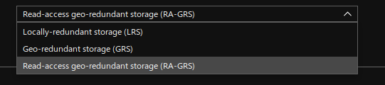
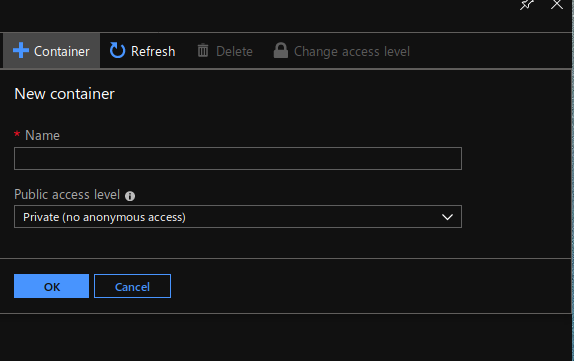
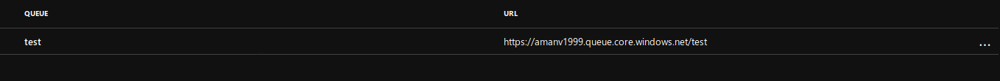
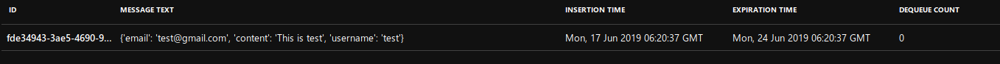
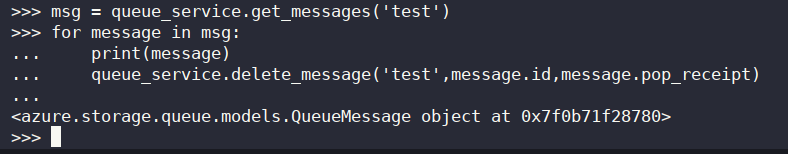

## Why storage
Suppose you have a image processing website . Now you don't want your website to function slowely. So you have a backend servers for that now. Now you also don't want your backend server to fail if number of process increases. So you make a storage account that stores processes and then you distribute those all processes equally in backend servers. 
After processing those all data should be now store somewhere else so you need a storage for that also. You don't use a database for storing because you can store object in database.



## Storage VS DataBase



## Azure Storage
Azure Storage is a service from Azure which provides storage for various purposes. Azure storage is a cloud storage solutions for modern applications be it be scalibility, durability and availability.

- General Purpose Storage
    - StorageV2(general purpose V2)
        + Incorporates all features of general purpose V1 and blob storage
        + Delivers lowest per gigabits cost
        + Support Access Tiers
            - Hot
                Optimised for data that is stored and accessed frequently.
            - Cold
                Optimised for data that is accessed infrequently and stored for atleast 30 days.
            - Archive
                Optimised for data that is that is hardly accessed and stored for atleast 180 days.

                

    - StorageV1(general purpose V1)
        + All features are same as general purpose V2 but with few difference.
        + When to use Storage V1
            - When you want azure class demplyment model.
            - When your applications is transition intensive and uses geo-replication bandwidth.
        + No zone replication storage (ZRS)

- Blob Storage
    + A Binary Large OBject (BLOB) is a collection of binary data stored as a single entity in a database management system. Blobs are typically images, audio or other multimedia objects, though sometimes binary executable code is stored as a blob.
    + Supports all access tiers.



*Replication*
- Zone Redundant Storage (ZRS)

Suppose you have 2 zones (i) Delhi (ii) Kolkata. Your data will be replicated to both the datacentre so that if your one zone gets down your storage account will be up from other zone datacentre.

- Locally Redundant Storage (LRS)

Suppose you have your storage account in a datacentre in Delhi. Now if your server crashes your data will be replicated to Delhi datacentre i.e in which you have actually deployed your storage account.

- Geo Redundant Storage (GRS)

Suppose you have two regions (i) America (ii) India. Both of the regions have number of zones in it. Your data will be replicated to zones of both the regions.

- Read-access-geo-redundant Storage (RA-GRS)

Consider the above scenario where you have two regions America and India. Now if your main server which is in New York (a zone in region America) crashes, you can only read data from India Region.



### Components of Azure Storage

#### Blob Service
File system service where you can upload any file. Same as S3 in Amazon Web Services.
*Containers* Here containers are same as folder where you store files.

There are 3 public access levels

- Private
Files can be accessed by only this owner.

- Blob
Files can be accessed by others inside this container.

- Container
If there is a folder inside this container that also can be accessed.



#### Queue Service
Queue Service is almost same as queue data structure which follows FIFO concept. Suppose we have a image processing website which performs various process. We can store all the processes there and then assign each process to every server.



*Send the message to Azure Storage Queue*

- Install the azure storage python library
```
pip install azure-storage
```

- Import the serivces and send the message
```
from azure.storage.queue import QueueService

queue_service = QueueService(account_name='', account_key='')
queue_service.create_queue('test')
queue_service.put_messages('test', '<message>')
```



*Peek message in Azure Storage Queue*

You can peek the message in front of the queue without deleting the message in front of the queue.

```
messages = queue_service.peek_messages('<queue_name>')
for msg in message:
    print(msg.content)
```

*DeQueue Messages from Azure Storage Queue*

Dequeuing the message from the Azure Storage Queue will automatically delete the message from the Queue. Let's have a quick look on it.

```
messages = queue_service.get_messages('<queue_name>')
for msg in messages:
    print(msg.content)
    queue_service.delete_message('<queue_name>', msg.id,msg.pop_receipt)
```




