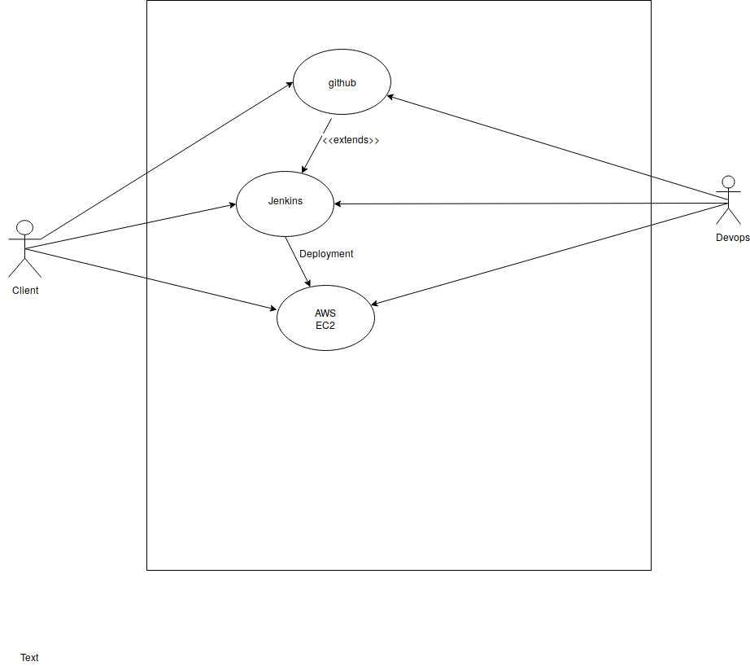
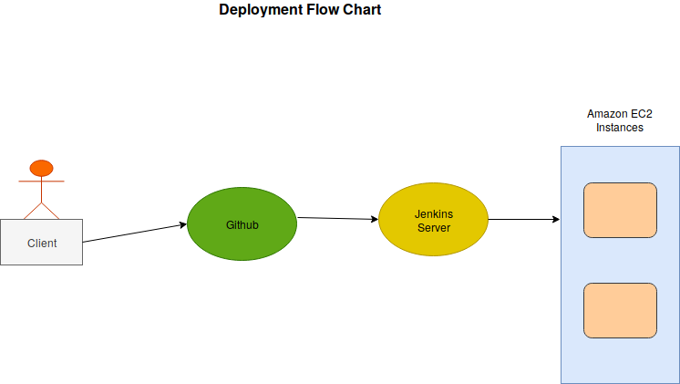

# Docs contains a brief of tasks I performed during my Intern
All the tasks are visible in my Azure account but I have deleted the junk and dump activities. Still you can read about them in the activity portal. 

## Cloud Computing

Before starting with something you need to know the basics because basics will help you to build and learn the upper concepts.
Three types of cloud are there :-
    + public
    + private
    + hybrid
The serices provided in cloud 
    + IaaS
    + PaaS
    + SaaS

## Virtual Machine and Virtual Network

I know this is an easy task but I did this task with the help of Azure Cli instead of using Azure Portal.

## Hosting a php webapp on Azure

For hosting php webapp on azure is easy you just need and ```composer.json``` file for dependencies. Its easy you just need to do the folowing steps.
    + Create a webapp user
    + Create an appservice plan
    + Create webapp and push your code in local git repo

## Hosting a Django WebApp with Azure Postgress Database on Azure

Hosting a django webapp with azure postgress database require certain genuine steps to be performed. In brief you need to perform the following steps.
    + Install postrgress database in your system.
    + Create a postgress server with resource group, name of server, admin username, admin password, sku and location
    + Create a firewall rule to allow your local IP
    + Create empty database and user access
    + Configure the database name , password , username and password for your app by exporting.
    + Allowed hosts in django settings.
    + Create a webapp user
    + Create appservice plan
    + Create a local git repo and push code your website will be posted.

## Azure Mointor

Using Azure monitor for monitoring your machines.

## Backups and Site Recovery

Using Azure Backups and Site Recovery for enabling backups on Virtual Machine

## Azure DevOps

    + Azure Boards
        How to track you work and maintaining backlogs.
    + Azure Test Plans
        Testing your products.
    + Azure Pipeline
        Create, build and deploy projects
    + Azure Repos
        Create private git repos for source code management.
    + Azure Artifacts
        create, host and share packages. Basically used for package management.

## Azure CDN

Content Delivery Network used for serving static data files. Serving large image and videos. Used in the personal project.

## Azure Storage 

    + Blob
        Containers used for storing binary large objects and files.
    + Queue 
        Recording messages from the user.
    + Files
        Same as FTP and can be used for extending your disk size. 
    + Tables
        Used for storing data like nosql database.

## Configuring Jenkins for a client Appplet

Configured jenkins for picking code from github repo by authenticating Github repo with ssh keys and then deploying the code to the Client's virtual machine in AWS EC2.

This is a use-case diagram 


## Hosting a django app in VM on Azure with a network group and virtual network

Hosting django app in VM includes the following tasks.
    + Create a Network Security Group
    + Create permission by allowing your IP
    + Create Virtual Network and a subnet and attack NSG to it.
    + Create a virtual machine put your code in it and visit the public IP of that VM.

## Deploying the Client code to the cluster of production servers

