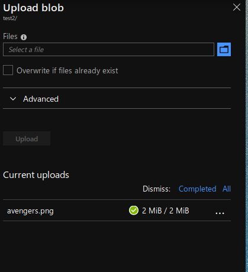

# Azure CDN
A content delivery network (CDN) is a distributed network of servers that is used to serve content to the users. A CDN stores cached data on the servers that are close to the end users to reduce the latency.


## How does Azure CDN works ?

- A user let's say Alice request for a file using the URL with a special domain <endpoint>.azureedge.net. The request will go to the nearest *edge servers* .
- If not cached data is found in *edge servers* then the request will *edge server* will request file from the *origin server*. The *origin server* send the file to the *edge server*. The edge server caches the file and send the file to the user(Alice).
- The cached file remains in the edge server until the the time-to-live (TTL) specified by its HTTP header expires.
- By default the time-to-live is 7 days.

## Serving static image and files using Azure CDN

- Create a storage account 

You need a storage account for using Azure CDN. Create a storage acount according to your requirements.


- Create a container and Upload an image

Containers are used to store files and folders in Azure.


Now, click on the upload button and upload a file or image you want to server to the user.



- Create an Azure CDN account and an endpoint

Move back to your storage account and click on *Azure CDN* and create an Azure CDN account. After creating an Azure CDN account you need to create an endpoint which will help you with serving your file and images.


After creating an endpoint click on the endpoint generated.

Click on the endpoint URL on the top right and add your *container name* and *filename* with a ```/``` between them, just like shown below

