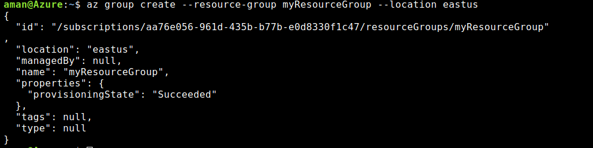

## Virtual Network
Facilitates data communication between two or more VMs.

There are many ways in which we can create a virtual network
- Azure Portal
- Azure PowerShell
- Azure CLI

### Creating a virtual network
- Create a Resource Group

A resource group is an individual entity which is a container for multiple resources.

```az group create --resource-group myResourceGroup --location eastus 
```


