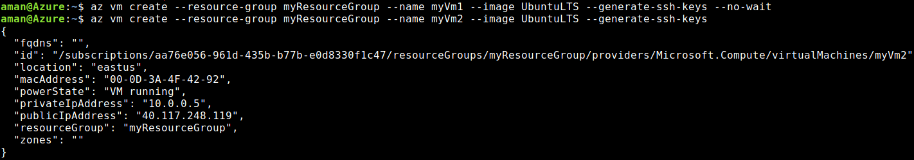
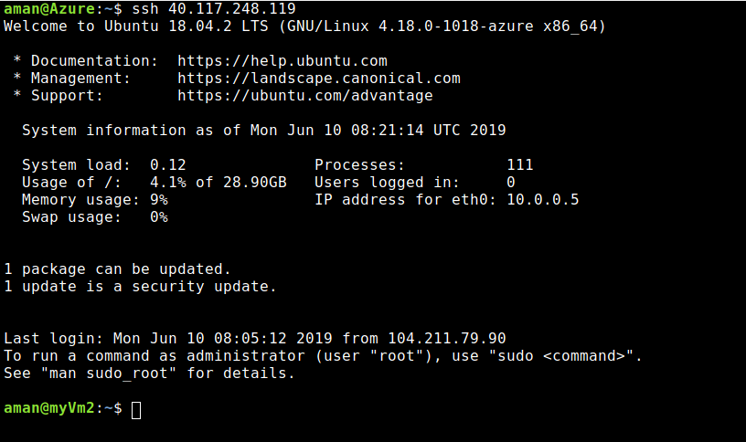
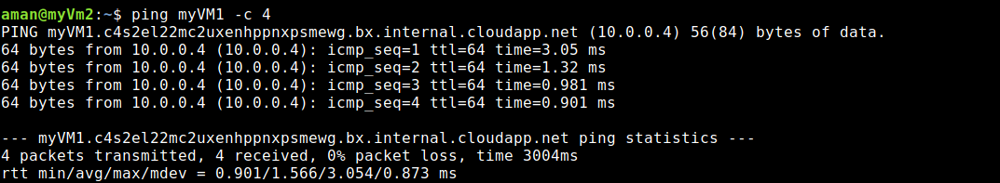

## Virtual Network
Facilitates data communication between two or more VMs.

There are many ways in which we can create a virtual network
- Azure Portal
- Azure PowerShell
- Azure CLI

### Creating a virtual network
- Create a Resource Group

A resource group is an individual entity which is a container for multiple resources.
```
az group create --resource-group myResourceGroup --location eastus 
```


You will wonder why location is required. Resource group stores metadata about resources and as a result we need to give him a location a place to store the metadata.

- Creating a Virtual Network

Virtual network facilitates data communications between two or more VMs. To create a Virtual Network use the following command
```
az network vnet create --name myVirtualNetwork --resource-group myResourceGroup --subnet-name myVirtualSubnet
```


- Create virtual machines

Create two VMs in the virtual network.

Create the first VM

Create a VM with az vm create. If SSH keys don't already exist in a default key location, the command creates them. To use a specific set of keys, use the ```--ssh-key-value``` option. The ```--no-wait``` option creates the VM in the background, so that you can continue to the next step. This example creates a VM named ```myVm1```:

```
az vm create --resource-group myResourceGroup --name myVm1 --image UbuntuLTS --generate-ssh-keys --no-wait
```

Create the second VM

```
az vm create --resource-group myResourceGroup --name myVm2 --image UbuntuLTS --generate-ssh-keys
```



- Connect to the internet

```
ssh <public IP of the VM2>
```


- Communicate between two VMs
To communicate betweeen two VMs use the following command
```
ping myVM1 -c 4
```
You will receive 4 replies from VM1.


