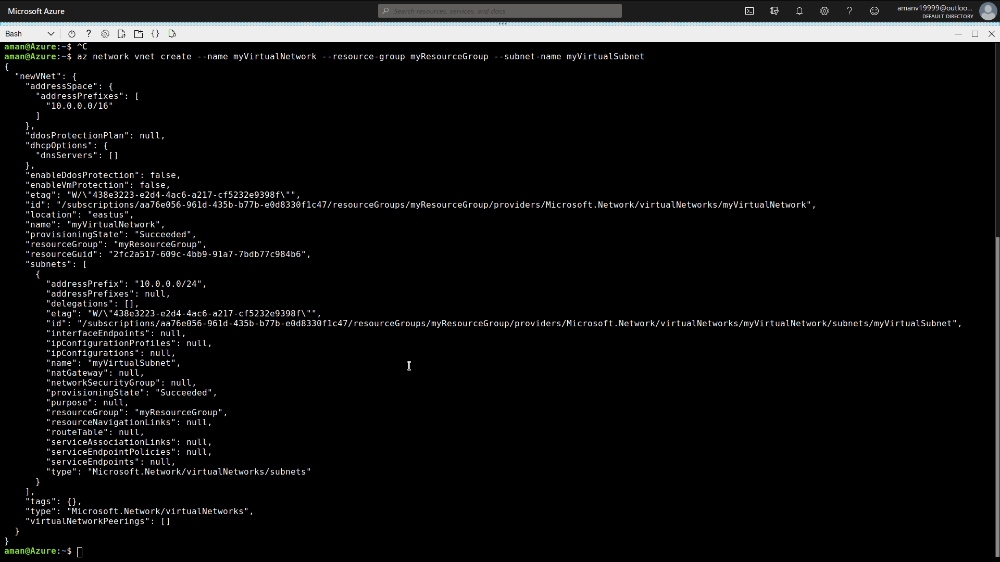

## Virtual Network
Facilitates data communication between two or more VMs.

There are many ways in which we can create a virtual network
- Azure Portal
- Azure PowerShell
- Azure CLI

### Creating a virtual network
- Create a Resource Group

A resource group is an individual entity which is a container for multiple resources.
```
az group create --resource-group myResourceGroup --location eastus 
```


You will wonder why location is required. Resource group stores metadata about resources and as a result we need to give him a location a place to store the metadata.

- Creating a Virtual Network

Virtual network facilitates data communications between two or more VMs. To create a Virtual Network use the following command
```
az network vnet create --name myVirtualNetwork --resource-group myResourceGroup --subnet-name myVirtualSubnet
```

